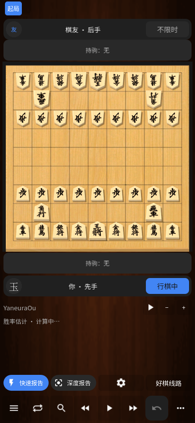

# 将棋 · Shogi Studio

[简体中文](README.md) · [English](README.en.md) · [日本語](README.ja.md)

0.35.0 では平面盤・駒・明暗配色を刷新しました。最新の手に戻ると自動的に対局を再開でき、履歴を見ている間も待ったが使えます。[検証記録](docs/TESTING-0.35.0.md)。

Android・Windows 向けの無料将棋アプリです。Godot 4.7.2 と、やねうら王のローカル解析エンジンを使用します。現在のバージョンは **0.35.0**。**既存の機能はすべて無料で、会員制度・購入画面・有料解除はありません。**



## インストール

ソースと配布ファイルを公開しました：[0.35.0 Release](https://github.com/DipperHide/shogi-studio/releases/tag/v0.35.0)。棋譜一覧の毎日更新が有効になり、クラウドでの初回更新も成功しました。

[Releases](https://github.com/DipperHide/shogi-studio/releases) から `Shogi-0.35.0-android-arm64.apk` をダウンロードしてください。ARM64 対応 Android 端末向けの完全な APK です。Windows は `Shogi-0.35.0-windows-x64.zip` を展開し、`Shogi.exe` を実行します。`engines` フォルダーは同じ場所に置いてください。

Android のパッケージ名は `org.shogistudio.artpreview`、versionCode は 52 です。release テンプレートで書き出し、上書き更新のため従来の開発用署名を継続しています。秘密鍵は含めません。異なる署名のビルドを入れる前に棋譜をバックアップしてください。

## 主な機能

- 6 段階のコンピューター、同じ端末での二人対局、エンジン同士の対局、IP 直接接続、Android Bluetooth。合法手・成り・持駒の打ち込み・禁手を確認します。
- 2D／3D 盤、明暗テーマ、配色、反転、ドラッグ、座標表示、縦横比を保つ持駒。0.20 では木製盤を明るく、幅広くしました。
- メイン画面の待った、アニメーション付き棋譜再生、解析結果、候補手順の再生、選択局面からの対局再開。
- 1～5 本の候補手順、簡易／詳細解析、推奨手順、悪手通知、推定勝率、失敗手の練習、局面段階別統計。
- 0.21 では棋士名を独立した行に表示し、勝者のトロフィー、段階の長さに応じたスコアバー、折り返す指標欄を追加しました。タッチ・キーボードで詳細を開けます。将棋用のレーティング推定は未校正のため「—」です。
- JSON・KIF・CSA・USI・SFEN の入出力、局面編集、対話型レッスン、棋譜保存、バックアップと復元。アイコンは龍王の「龍」です。
- 0.22 の評価グラフは先後の優勢領域と重要な着手のアイコンを表示します。アイコン選択、キーボード・ドラッグ操作、段階境界の位置合わせに対応します。
- 0.23 では分類統計を折りたたみ表示にし、品質グラフに重み付き割合を明記しました。説明表示、回転、キーボード選択、分類から棋譜への移動に対応します。
- 0.24 では再生位置を素早く変更しても、表示中の駒の位置・大きさ・成りの裏返しを引き継ぎます。駒取り、駒打ち、逆再生、盤の反転に対応します。
- 0.25 では入れ子の変化、二段の指し手欄、長押しによる本譜への昇格、削除の取り消し、変化ごとの注釈に対応します。本譜を残すか自動で置き換えるかを選べます。全変化の保存・出力・バックアップには JSON を使用します。
- 0.26 では目盛り・評価値・深度付き評価バー、自動・左側・下部配置、連続アニメーションを追加しました。棋譜再生で詰み手数を保持し、左側表示でも選択局面から対局を再開できます。
- 0.27 では局面編集に独立した評価値、停止、駒のドラッグ、局面ごとの取り消し・やり直し、保存局面選択、SFEN 操作を追加しました。取消・完了を下部に固定し、持駒入力のはみ出しを修正しました。
- 0.28 は駒の開始位置を描画してから移動を進め、描画遅延による残りの動きの飛ばしを防ぎます。低フレームレート時には再生時間が延びます。Windows の描画停止自体は未解決です。
- 0.29 は分類・先後の絞り込み、多言語の別名検索、独立した戦法プレビューを追加しました。読み込むまで元の棋譜を保持し、選択した手を引き継ぎます。横画面では盤面全体を表示します。九つの学習例であり、棋士対局の勝率データはありません。
- 0.30 は分析画面内の棋譜入力・貼り付け・ファイル操作、入力元タブ、保存棋譜検索を追加しました。長文や UTF-8／CP932 の全文・コメントを別スレッドで検証し、成功時に分析盤へ読み込みます。閉じた画面への古い結果は反映しません。
- 0.31 は大会の全画面一覧、下部フィルター、大会の複数選択、行全体からの読み込み、対局ごとの進捗・保存表示を追加しました。最近・過去で一覧状態を保持し、別スレッドで合法性を確認します。古い結果は現在の棋譜を置き換えません。
- 0.32 のヒントは成・不成を明記し、2D・3D の盤上表示と候補番号を対応させました。同じ移動先の選択肢を区別でき、読み筋の途中と復習問題でも不成を表示します。[成りのヒント](docs/PROMOTION-HINTS.md)を参照してください。
- 0.33 で自分の棋譜と大会棋譜を共通タブに統合。お気に入り、タグ、情報編集、SFEN 検索、独立したアニメーション付きプレビューを追加。選択手数を保って読み込み、バックアップにもタグ等を保存します。[使い方](docs/PERSONAL-ARCHIVE.md)。

- 0.34 では持ち駒台を明るい木目にし、対局者名と時計の重なりを修正しました。メニューで盤面を縮めず、英語・日本語の盤面と設定表示を確認しました。変更後は保存・破棄・編集続行を選べます。龍王アイコンも明るい木目に変更しました。[保存と実機確認](docs/OPTIONAL-SAVING.md) を参照してください。

[変化の使い方](docs/VARIATIONS.md) · [0.34 の検証結果](docs/TESTING-0.34.md)（中国語） · [Evaluation bar / 評価バー / 评价条](docs/EVALUATION-BAR.md) · [Position editor / 局面編集 / 局面编辑](docs/POSITION-EDITOR.md) · [Opening preview / 戦法プレビュー / 开局预览](docs/OPENING-PREVIEW.md) · [Analysis import / 棋譜入力 / 分析导入](docs/ANALYSIS-IMPORT.md) · [Tournament archive / 大会棋譜 / 大赛棋谱](docs/TOURNAMENT-ARCHIVE.md)

高度な画面とレッスン本文は主に中国語です。基本ナビゲーションは中・英・日文に対応しますが、三言語 README はアプリ全体の翻訳完了を意味しません。

## 日本の大会棋譜の更新

最近の一覧には **26 局**を収録し、現在の最新は **2026 年 9 月 8～9 日の王位戦第 6 局、140 手**です。別途、過去の完全棋譜 **195 局・23,115 手**をオフラインで利用できます。

[定期更新ワークフロー](.github/workflows/update-tournaments.yml) が毎日日本時間 06:23 頃に公式中継ページを確認します。アプリは最近の大会一覧を開くと 1 日に 1 回 HTTPS 経由で確認し、「刷新」で手動更新もできます。新しい対局ごとの APK 再インストールは不要です。GitHub の実行には遅延があり、デフォルトブランチでワークフローを有効にしておく必要があります。

公開一覧には対局情報、公式リンク、指し手ハッシュのみを含めます。対局を選ぶと公式公開 KIF を取得し、UTF-8／CP932 の判別、解説の除去、ハッシュと全指し手の合法性確認を経て端末に保存します。更新に失敗しても既存データは残り、取得済み棋譜と過去棋譜はオフラインで再生できます。

公式公開状況に応じて王位・王座・棋王・棋聖・叡王・竜王戦の入口を確認します。最近の完全 KIF が取得できない大会もあり、全大会・有料棋譜・進行中の対局を網羅するものではありません。[公式棋戦一覧](https://www.shogi.or.jp/match/) と [更新の運用説明](docs/TOURNAMENT-UPDATES.md) を参照してください。

## ビルド・テスト

Windows、Python 3.11 以降、Godot **4.7.2** と対応テンプレート、JDK 17、Android SDK 36、Build Tools 36.0.0、NDK 28.1.13356709 を使用します。[toolchain.example.json](toolchain.example.json) のパスを変更して `%USERPROFILE%/Development/toolchain.json` に保存してください。

```powershell
python -m venv .venv
./.venv/Scripts/python.exe -m pip install -r requirements-dev.txt
./scripts/build_android.ps1
./scripts/build_windows.ps1 -OutputDirectory builds/windows-0.35.0
./scripts/test_chessis20.ps1
./scripts/test_chessis20.ps1 -CoreOnly -Network
./scripts/test_chessis23.ps1
./scripts/test_chessis24.ps1
./scripts/test_chessis31.ps1 -CoreOnly
./scripts/test_chessis31.ps1
./scripts/test_chessis32.ps1
./scripts/test_chessis33.ps1
```

開発時は Godot で `godot/project.godot` を開きます。実行用素材、エンジン、NNUE は同梱し、対応するエンジンソースはビルド時に同梱アーカイブから展開します。release APK にはローカルで `GODOT_ANDROID_KEYSTORE_RELEASE_PATH`、`GODOT_ANDROID_KEYSTORE_RELEASE_USER`、`GODOT_ANDROID_KEYSTORE_RELEASE_PASSWORD` を設定し、`./scripts/build_android.ps1 -Release` を実行します。署名情報をコミットしないでください。

[CI](.github/workflows/ci.yml) は push・PR 時にコアテストを実行します。ローカルでは 4 種類の画面サイズ、先後反転、明暗、駒取り・成り・駒打ち、連続フレームの動き、実エンジンも確認します。[0.23 分類統計の検証](docs/TESTING-0.23.md) と [0.20 盤・大会更新の検証](docs/TESTING-0.20.md) を参照してください。バグが完全になくなる保証はできません。Android 14 の実機で起動、棋譜一覧、2D／3D 再生を確認しました。[実機記録](docs/ANDROID-DEVICE-BASELINE.md) に測定値を掲載しています。Bluetooth 二台接続は未検証です。

検証用 Windows PC では、空のウィンドウでも約 450 ミリ秒の描画停止が発生し、未解決です。すべての端末で常に滑らかな動作を保証するものではありません。[0.24 アニメーション検証](docs/TESTING-0.24.md) を参照してください。

## データ・クレジット

保存先は従来の `ShogiStudio` ユーザーディレクトリです。Android ではアプリ専用領域を使い、大会棋譜は `user://tournaments/` に保存します。更新時に個人の対局を送信しません。

独立した将棋 UI 適応プロジェクトであり、Chessis、日本将棋連盟、各大会主催者とは関係がありません。元アプリの全機能・全画面の再現をうたうものではありません。[既知の差異](docs/CHESSIS-PARITY.md) を参照してください。やねうら王は対応する GPL ソースを同梱し、菱湖書体、フォント、評価関数、参考 UI にはそれぞれの条件を適用します。MIT として再許諾していません。[第三者素材の説明](THIRD_PARTY_NOTICES.md) を参照してください。
