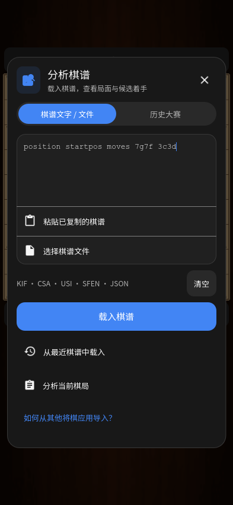

# 分析棋谱 · Analysis import · 棋譜の読み込み

0.30 将分析入口改为参考应用的圆角弹窗、分段页签和内嵌棋谱输入卡片。粘贴与文件选择在同一卡片内，“最近棋谱”单独成行。载入成功后直接进入主棋盘分析，可以逐手回放、查看候选线路或从选中局面继续下。

## 使用

1. 打开“分析棋谱”，在“棋谱文字 / 文件”中输入或粘贴 KIF、CSA、USI、SFEN 或本应用 JSON，再点“载入棋谱”。选择文件后直接校验并载入。
2. 长文本超过 16,000 字时显示只读预览，完整内容仍用于校验。可以重新粘贴或清空；不会把截短的预览当作原棋谱。
3. 从“最近棋谱”中搜索、选择本机保存的对局。“历史大赛”保留近期官方目录和 195 局离线棋谱。
4. 错误显示在弹窗内，原对局和变化分析保持原状。成功载入才结束旧变化会话并显示新棋谱；进行中的实际对局仍保留。

输入与文件限制为 2 MiB。普通导入保留棋谱文字注释；公开赛事下载仍使用原有去除讲解的流程。文件支持 UTF-8、UTF-8 BOM 与 CP932（Windows Shift JIS），不表示已支持所有 KIF 方言、KI2 或所有历史编码。SFEN 只代表一个局面。

合法着手检查在独立线程进行。关闭导入流程后，旧文件选择回调或校验结果不能重新打开页面或替换后来选择的棋局；同一时刻只有一个校验任务。关闭页面会丢弃结果，已开始的计算会完成后释放线程，并不强行中断计算。应用退出时等待该线程结束。

## English

The analysis dialog has an inline record field, explicit Paste and Choose File actions, two source tabs and a separate Recent Games list. Load KIF, CSA, USI, SFEN or this app's JSON directly into analysis. The original live game stays intact; valid imports end any previous variation session before replacing the reviewed record.

Files support UTF-8/BOM and CP932, with a 2 MiB limit. Text over 16,000 characters has a read-only preview while the complete source, including comments, is parsed in a private worker. Dismissed picker replies and parser results are ignored. Recent games support search and pagination; history includes the existing official catalog and offline collection. Chess PGN and Lichess games cannot be converted into shogi, and no account connection is claimed.

## 日本語

分析ダイアログ内で棋譜を入力・貼り付け・ファイル選択でき、保存済み棋譜は別の一覧から検索して読み込めます。KIF・CSA・USI・SFEN・本アプリの JSON に対応し、読み込み後は手順再生、候補手の確認、選択局面からの対局が可能です。検証に成功した場合だけ以前の変化分析を終了し、表示中の棋譜を置き換えます。進行中の対局は保持します。

UTF-8／BOM と CP932 に対応し、上限は 2 MiB です。16,000 文字を超える場合はプレビューのみを短縮し、コメントを含む全文を別スレッドで検証します。閉じた画面への古い結果は反映しません。チェスの PGN や Lichess の対局を将棋に変換する機能ではありません。

## 参考与验证边界

静态证据来自用户的 Chessis 20.9 APK：

- `dialog_analyze_game.xml`：40dp 图标、40dp 页签轨道、16dp 外边距与圆角弹窗。
- `tab_content_pgn.xml`：120dp 等宽输入、46dp 粘贴／文件行、50dp 最近棋谱入口。
- `p174X2/C1565c.java`：窗口宽度为屏幕 94%，最大 420dp；记住上次页签。
- `p174X2/ViewOnClickListenerC1568f.java`、`C1567e.java`：显式粘贴、16,000 字预览与完整源文本分离。
- `p252h2/C3459e.java`、`p373y3/RunnableC4917d.java`、`MainActivity.m4468C0`：输入交给棋盘分析入口。

原版的 PGN／Lichess 页签在将棋版适配为“棋谱文字 / 文件”／“历史大赛”；并未实现 Lichess 账号。宽高单位由 Godot 逻辑像素适配，不能据此宣称与 Android dp 逐像素一致。原 APK 缺少所需分包，未运行原版逐屏核对。

明暗主题与四种尺寸、输入、取消、编码、长注释、变化会话、真实引擎与成品检查见 [0.30 测试记录](TESTING-0.30.md)。没有 Android 真机测试；系统文件选择器、后台恢复仍需实测。
