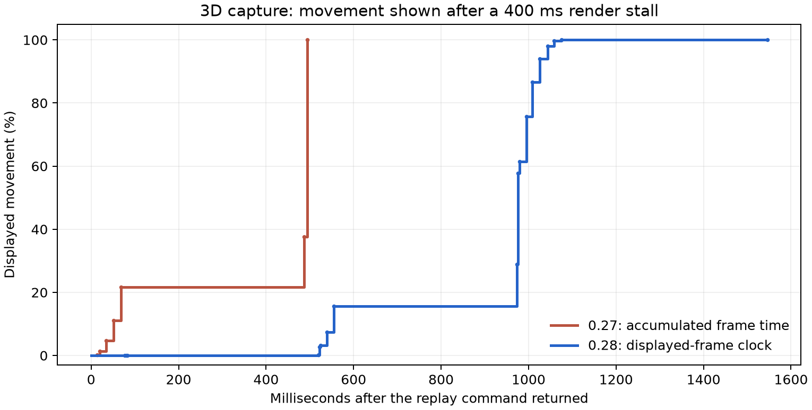

# 0.28 棋子动画计时

部分落子和报告回放在第一帧就已经走完大半段动画，绘制停顿后还可能直接跳到末尾。0.28 让棋盘先画出起点，再按实际绘制帧推进移动；绘制中断后继续播放尚未显示的部分。该机制用于主棋盘和教程，覆盖普通落子、反向回放、吃子、升变、持驹打入、分析和失误练习。

图中每个点都是 `frame_post_draw` 观测到的实际动画进度，台阶表示该帧持续显示到下一帧。两次运行均在同一 3D 吃子回放的中途注入 400 毫秒停顿；新运行也遇到额外的自然绘制停顿，图中保留了它。曲线不能作为“帧率已改善”的证据。

## 实现与取舍

Godot 的 Tween 在节点处理后使用帧时间推进。新产生的动画可能接收到当前帧的大时间增量，故不能把“从 0 创建了 Tween”当作“起点已经显示”的证明。现在原生 Tween 保持暂停，由一个绑定到棋盘的控制器调用 `custom_step`，继续沿用原来的三次／正弦缓入缓出曲线。

控制器等待一次配对的 `frame_pre_draw`／`frame_post_draw`，确认起点已经进入绘制帧。随后以单调时钟计时，每个已经显示的帧最多推进一次，步长不超过 1/30 秒或所选动画时长的 1/9，取较小值。对三次缓入缓出曲线，这把相邻绘制帧的动画进度增量限制在约 30% 以内。停顿积累的时间不会在后面几帧补跑。

**这会在低帧率或绘制停顿时延长实际播放时间，保证仍能看到移动过程。** 快速、标准和慢速设置仍提供不同的名义时长；主棋盘关闭动画时立即显示终点。棋局用时和规则不使用这个动画时钟。

连续切换回放仍立即选中目标手数，并从当时显示的棋子姿态重新开始。取消会释放旧控制器，关闭页面会移除全局绘制回调；暂停、隐藏、最小化或收到应用后台暂停通知时不累积动画时间。恢复后从当前姿态继续，避免后台时间造成跳步。确定性测试仍可暂停并手动推进原生 Tween，用于逐枚核对棋子与阴影。

实现依据：[Godot Tween](https://docs.godotengine.org/en/stable/classes/class_tween.html)、[RenderingServer 绘制信号](https://docs.godotengine.org/en/stable/classes/class_renderingserver.html)。这是将棋版的绘制适配，没有把该计时策略说成原 APK 的逐行移植。

## 验证范围

基线保留 0.27 的动画实现，用同一棋谱和入口运行 22 个场景。新实现覆盖这 22 项，再加快速、慢速和教程，共 25 项；记录起始帧、每帧进度、实际时间和停顿是否确实注入。报告同时检查至少八个已绘制的中间进度、最终完成与单帧增量上限。另测关闭动画、暂停恢复、连续 24 次定位后的控制器释放和教程关闭清理。

原有 36 次回放中断测试继续核对全部 40 枚棋子的二维矩形、三维变换、棋面以及相机。自然绘制的 22 段计时与功能检查分开报告，不因为中间帧增加而算作性能通过。

本机 Windows 的间歇性长时间绘制停顿仍未解决；这次修复避免它同时吞掉整段移动，不能消除画面停住本身。本轮没有 Android 真机，不能推断其实际帧率，也未证明原应用全部 UI 与功能已完整复制。详细数据见 [0.28 测试报告](TESTING-0.28.md)。

图表可用 `pip install -r requirements-charts.txt` 安装可选绘图依赖，再运行 `python scripts/create_motion28_chart.py` 重建。

## English

Piece movement now displays its starting pose before advancing, then uses actual rendered frames and a monotonic clock. Large frame delays are capped and discarded rather than consuming the remaining animation in one jump. This applies to the main board and lessons, including captures, promotion, drops and reverse replay. Existing curves, cancellation and mid-move retargeting remain in use.

Motion can take longer on a slow or stalled renderer so that the remaining poses are visible. This does not fix the measured Windows rendering stalls or establish Android device performance. The comparison includes real frame observations and an injected 400 ms stall; timing failures remain separate from functional passes.

## 日本語

駒の移動は開始位置が描画されてから進むようになりました。実際の描画フレームと単調時計を使い、大きな遅延を一度に加算して残りの移動を飛ばすことを防ぎます。盤面とレッスンの駒取り、成り、駒打ち、逆再生に適用し、移動中の再選択は表示中の姿勢を引き継ぎます。

低いフレームレートや描画停止時には、残りの動きを表示するため再生時間が延びます。Windows で観測された描画停止そのものは未解決で、Android 実機の性能確認も未実施です。400 ミリ秒の停止を注入した実描画の比較と、自然な描画間隔の測定を分けて記録しています。
