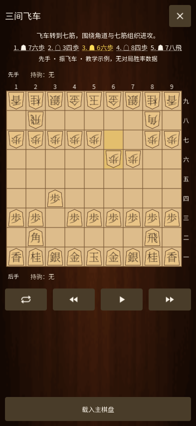
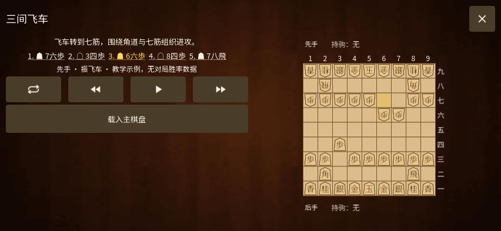

# 开局与围玉预览 / Opening preview / 戦法・囲いのプレビュー

0.29 将开局列表和预览分开。点击示例先打开独立棋盘，不替换当前棋谱；关闭后保留原棋谱、注释、回放手数和列表筛选。点击“载入主棋盘”才把完整示例放到主棋盘，并停留在刚才选中的一步，可继续分析或从这里对弈。

- 搜索名称、说明或中英日常用名称，例如“三间”“三間飛車”“third file”。输入时立即筛选，可清除搜索。
- “开局 / 围玉”和“全部 / 先手 / 后手”组合筛选。前三条是双方示例，同时出现在先手和后手筛选中；其余是先手布局。
- 预览默认显示示例末手；上一手、下一手、点击着手文字定位。长按上一手回起局，长按下一手到末手。
- 播放到末尾后自动停止；在末尾重新播放会先回起局。暂停保留当前手，手动导航停止自动播放。
- 翻转只影响预览棋盘；载入主棋盘时一起带入朝向。移动使用与教程相同的实际绘制帧计时，关闭动画设置同样生效。
- 竖屏固定底部载入按钮；横屏将说明、操作与棋盘并排，完整棋盘保持正方形。

Open an example to inspect it on a separate board. The current game and replay cursor stay intact until **Load on main board** is selected. Search accepts Chinese, Japanese and English aliases. Step through the line, click move text, hold Previous/Next to reach the beginning/end, flip the board, or play and pause. The chosen move and full continuation are retained when loading.

例を選ぶと独立した盤面で確認できます。「載入主棋盤」を選ぶまで元の棋譜と再生位置を保持します。中・英・日文の別名検索、手順の選択、前後の移動、長押しで最初・最後へ移動、反転、自動再生・停止に対応します。読み込むと選択した手と後続の手順を引き継ぎます。

## 原 APK 对照与范围

基于用户提供的 Chessis 20.9 APK，SHA-256：`14df01b58e777a130aee977c51a9b7823c8c8ada31479843b2f01b765b49f111`。本轮使用静态布局和反编译逻辑核对；没有可运行的完整原版分包环境，不表示完成像素级对照。

| 本地证据 | 对应交互 |
|---|---|
| `res/layout/dialog_opening_list.xml` | 木纹全页、标题、搜索、分类和双方筛选、列表、关闭。 |
| `res/layout/dialog_opening_list_item.xml`；`p167W2/C1501b.java` | 棋子侧别标记、名称、着手、统计和元信息；没有数据时显示无数据。 |
| `res/layout/dialog_opening_info.xml` | 独立预览棋盘、着手、翻转、前后与播放、载入主棋盘。 |
| `p159V2/C1447i.java` 的 `m2168j0`、`m2169k0`、`m2173o0` | 默认末手、当前着手突出显示、取消待执行回放。 |
| `p159V2/ViewOnLongClickListenerC1441c.java` | 长按跳到首尾。 |
| `p159V2/ViewOnClickListenerC1439a.java` | 播放从起局演示、停止后保留播放位置。 |

将棋适配采用“开局 / 围玉”，原版的陷阱页尚未复制。本轮保留既有九条合法教学示例，没有增加完整定式、陷阱训练或大师开局数据库，也没有编造样本量或胜率。预览中的“无对局胜率数据”与主棋盘的引擎胜率估计是两种不同的信息。自动播放在移动完成后再留出阅读时间，因此受设备帧率和动画速度影响，不保证与原版固定一秒节拍相同。

来源 APK 与反编译文件仅用于本地核验，不附带在公开仓库；验证文件保留各项证据的哈希。
