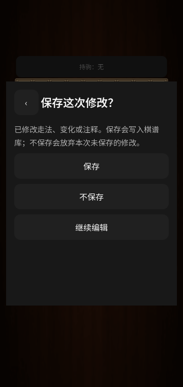

# 保存选择与手机交互 · 0.34

棋谱库只收录用户选择保存的记录。仅载入、前后回放、自动回放、查看已有变化，都不会新建文件，也不会为了记录光标位置改写已有棋谱。

修改走法、主线、变化或注释后，分析栏显示“保存”。结束分析或载入另一份棋谱时，可以选择“保存”“不保存”“继续编辑”。撤销到原来的内容后，不再提示保存。已有棋谱保存到原文件，新分析保存为新文件；保存失败保留修改和弹窗，支持重试或明确放弃。

开始新局、从选中局面继续、局面编辑替换和进入联机前，可以选择是否保存当前对局。空局和本次会话中已保存且未修改的对局不重复询问。仅把一份棋谱的某一步作为起局、尚未续下时，不当作新的已修改棋谱。选择之后会继续原来请求的操作，并保留目标手数、局面和方向。退出联机也提供“不保存并退出”。

棋谱库右下角文件夹先校验完整文件，再让用户选择“仅载入分析”或“保存到棋谱库并载入”。普通分析输入仍直接载入。导出文件、备份和主动按“保存棋谱”属于明确的保存操作。

当前实际对局的恢复文件继续保留在应用私有目录，不会自动变成棋谱库条目。未确认保存的变化分析目前保存在内存中；系统强制结束进程后的变化草稿恢复尚未实现。

## 本版性能与交互改动

- 取消进入变化分析、每次试下和退出未修改分析时的自动归档，减少文件写入。
- 读取已有分析标题只访问当前文件，不再扫描整个棋谱库。
- 静止棋盘的着手栏检查不再每帧序列化全部注释；注释编辑时明确刷新，未变化时复用控件。
- 快速更新着手栏后，旧控件的延迟滚动请求会被忽略，避免滚动到已移除的控件。
- 保存选择采用居中弹窗，窄屏和横屏下保留可滚动内容与三个选项。
- 龙王「龍」图标改为浅木色；Android 的透明棋子前景与浅色背景分别导出，前景留出遮罩空间。

这些改动减少确定存在的重复工作，尚未将手机上的帧时间变化归因于其中某一项。量测与后续方向见 [Android 实机记录](ANDROID-DEVICE-BASELINE.md)。

## English

Unchanged replay and navigation create no archive and do not rewrite existing files. Edited variations offer Save, Discard and Keep Editing; undoing back to saved content clears the unsaved state. Failed writes preserve edits. New matches, continuation and edited positions can proceed without saving the previous match. Folder imports can load for analysis only. A deferred save decision preserves the requested destination and orientation.

The current live match keeps its private recovery file. Unsaved analysis remains in memory; recovery of a variation draft after process termination is not implemented. The Dragon King icon now uses light wood colors and a separate transparent Android foreground. Frame polling no longer serializes every comment, and outdated deferred ribbon scrolling is ignored.

## 日本語

変更のない棋譜再生や手順移動では、新規保存も既存ファイルの更新も行いません。変化や注釈を編集すると、保存・破棄・編集継続を選べます。保存時点まで編集を取り消せば確認は不要です。保存失敗時は編集を保持します。新対局・途中局面からの再開・局面編集でも、直前の棋譜を保存せずに続行できます。ファイルの読み込みだけを選ぶこともできます。

進行中の対局は専用の復元ファイルを保持します。未保存の変化分析はメモリー内にあり、プロセス終了後の草稿復元は未対応です。龍王アイコンは明るい木色と独立した透明前景に変更しました。毎フレームの注釈全体の文字列化を削除し、無効になった指し手欄の遅延スクロールも防ぎます。
