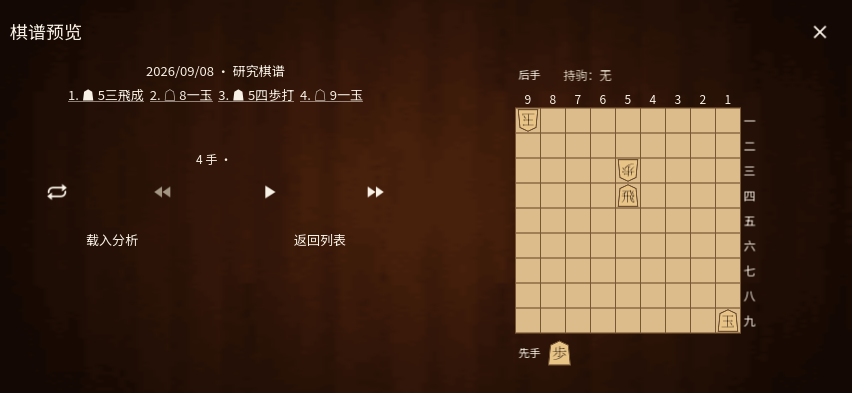

# 个人棋谱库 / Personal records / 自分の棋譜

0.33 将个人棋谱和大师棋谱放入同一全屏木纹档案，使用“我的棋谱 / 大师棋谱”页签。分析输入页的“最近棋谱”和菜单的“棋谱库”均进入这里。

- 点击整行载入分析；眼睛按钮打开独立预览，心形按钮收藏，信息按钮展开详情，铅笔按钮编辑名称、棋手、日期、赛事、场所与标签。
- 筛选支持多个关键词（全部匹配）、收藏状态、多个标签（任一匹配）、添加时间排序及 SFEN 局面。局面搜索逐手校验完整棋谱，包含行棋方和持驹；可填入当前棋盘局面。修改筛选后点击“显示结果”，关闭放弃草稿，重置清空条件。
- 预览从初始局面开始，上一手、下一手、自动播放、翻转和长按跳转复用现有动画。着手文字明确区分成与不成。“载入分析”保留选中手数，可随后从这里继续下。返回列表不会替换原棋局。
- 右下角文件夹选择文件，合法棋谱校验完成后可选“仅载入分析”或“保存到棋谱库并载入”。取消、错误和过期结果不会保存。一般分析输入仍可直接载入而不自动归档。
- 收藏、标签和添加时间随棋谱保存，包含在完整备份中；旧版棋谱与旧备份仍可读取。文件已被其他操作修改时，旧编辑会被拒绝，避免覆盖新数据。
- “编辑棋谱信息 → 导出 / 删除”保留原有单局操作。批量选择、批量分析／导出／删除、跨棋谱练习、已分析筛选和列表内报告统计尚未实现。

列表每次显示 20 局，可加载更多。扫描、打开和局面搜索在独立线程中执行。文件仍受既有 2 MiB 上限约束；预览只显示所选着手附近的文字，完整棋谱仍保留。大师棋谱的近期更新和 195 局离线历史库继续可用。

## English

Version 0.33 puts **My games** and **Master games** in a shared full-screen archive. Open it from the record library or recent-game action in analysis input. Tap a row to load analysis, the eye to preview, the heart to favorite, the information icon to expand metadata, or the pencil to edit metadata and tags.

Filter by all query words, favorite status, any selected tag, creation order, or an intermediate SFEN position. Position matching includes the side to move and pieces in hand and requires a legal replay. Apply commits filter changes; closing discards them. Record previews are independent, animated and preserve promotion choices. Load a preview at its selected ply, then continue play from there.

After validation, the folder action offers loading without saving or saving to the library before loading. Favorites, tags and creation times survive saving and backup/restore. Old files remain compatible, and stale edits cannot overwrite newer files. Export and delete remain available through the metadata editor. Batch actions, cross-record practice, analyzed-state filters and per-record report summaries remain incomplete. New screens are primarily in Chinese.

## 日本語

0.33 では、自分の棋譜と大会棋譜を共通の全画面一覧にまとめました。棋譜庫、または解析入力の最近の棋譜から開きます。行を押すと解析へ移り、目のアイコンでプレビュー、ハートでお気に入り、情報アイコンで詳細、鉛筆で対局情報・タグを編集できます。

複数キーワードの全一致、お気に入り、選択タグのいずれか、追加日時、途中の SFEN 局面で絞り込めます。局面検索は手番と持駒を含み、全手順の合法性を確認します。「显示结果」で適用し、閉じると変更を破棄します。独立したプレビューには移動アニメーションと成・不成の表示があり、選択手数を保って解析に読み込み、その局面から対局を続けられます。

フォルダーからの読み込みは検証後に、解析への読み込みのみ、または棋譜庫への保存を選べます。お気に入り・タグ・追加日時はバックアップでも保持し、旧形式にも対応します。古い編集内容による上書きは拒否します。情報編集から従来の書き出し・削除に進めます。一括操作、複数棋譜の復習、解析済み絞り込み、一覧内の解析集計は未対応です。新画面の主な表示言語は中国語です。

## 参考与验证

布局依据用户提供 APK 的 `dialog_recent_games.xml`、`dialog_recent_games_item.xml`、`dialog_games_filter.xml`；页签与操作依据静态反编译的 `p207b3/C2252w`、`p167W2/C1506g`、`p207b3/C2255z`、`p207b3/ViewOnClickListenerC2253x`。新增五枚图标的来源哈希见 [资源记录](../godot/assets/reference-ui/provenance.json)。未运行原 APK，因此不声明逐像素或完整交互一致。

[测试结果](TESTING-0.33.md) · [大师棋谱与更新](TOURNAMENT-ARCHIVE.md) · [升变提示](PROMOTION-HINTS.md)
