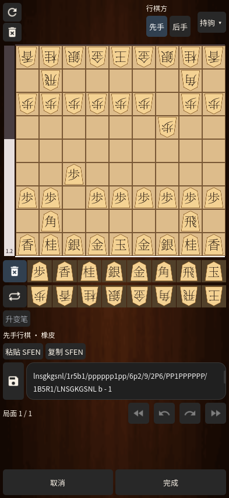

# 局面编辑 / Position editor / 局面編集

0.27 将局面编辑页改为木纹整页布局：上方重置、清空和行棋方，中间为方形 9×9 棋盘与独立评价条，下方是两排棋子、SFEN、保存和局面导航；取消／完成固定在屏幕底部。将棋的持驹与升变工具替代国际象棋专用规则控件。

## 使用

从菜单打开「局面编辑」时，以当前显示的棋盘为起点，包括分析或回放中选定的那一步。选择棋子后点格子摆放，橡皮可清除；也可以拖动已有棋子，或从棋子栏拖到棋盘。升变笔改变可升变棋子的笔刷。拖到棋盘外、收到触摸取消或失去焦点时保留原局面。

「持驹」展开双方七类计数，最大为标准棋具的总数量。输入框、撤销与完成按钮在窄屏上保持可见。清空或不完整局面可以继续编辑，但完成前必须通过王玉数量、棋子总数、二步、死子以及非行棋方被将军的校验。

撤销／重做保存棋盘、行棋方和持驹，每个载入局面有独立的本次编辑历史，最多保留 50 个状态。保存按钮将当前合法局面作为独立棋谱存入棋谱库，并加入最多 50 项的已保存局面列表；两端箭头在列表间切换。本次未保存的编辑历史会在切换后保留，但不会跨应用重启持久化。保存局面列表和评分暂停偏好进入设置及完整备份。

复制／粘贴使用 SFEN。输入停止 250 毫秒后尝试解析；格式错误会保留最后可解析的棋盘，同时阻止完成，不会悄悄应用旧局面。保存失败时保留编辑页与草稿。取消恢复原棋局和回放位置；完成以当前方向建立独立本地对局。合法的将死局面仍然可应用，并显示已结束的结果。

## 编辑器评价

左侧 18 像素评价条单独使用本地 YaneuraOu：停止编辑 250 毫秒后，以当前 SFEN、单候选、500 毫秒预算搜索。线程数为 1，Hash 不超过 64 MiB。它不复用当前对局的引擎搜索，旋转棋盘或选择笔刷不会重启分析。

普通评分沿用将棋版的分数尺度，显示一位小数；绝对值达到 10 时取整。条形比例以 750 毫秒动画更新，方向随棋盘翻转，分数位于优势一侧。詰手数和终局标记使用实际结果，未知局面清空旧分数。评分是引擎估计，不是保证胜负。

点击评价条暂停／恢复，设置可隐藏编辑器评价条。暂停、关闭编辑器会结束它自己的引擎进程。新编辑、故障或关闭会更换请求代号，拒绝迟到结果；故障最多自动重试两次，每次等待 500 毫秒，耗尽后保留错误说明。改变局面或重新开关可恢复尝试。

## 参考与边界

布局依据用户提供 APK 的 `dialog_board_setup.xml`；编辑历史、粘贴方向、独立搜索、暂停、延迟与故障重试依据局部反编译控制代码。来源及 SHA-256 记录在发布验证 JSON 的 `reference_evidence` 中。7 个新增操作图标的原始路径和哈希记录于 `godot/assets/reference-ui/provenance.json`。

参考实现对应关系：`p359w2/C4772p.java`、`C4773q.java`、`RunnableC4770n.java`、`ViewOnClickListenerC4766j.java`、`C4757a.java`、`C4762f.java`、`p352v1/C4718l.java`、`p016C0/RunnableC0151b.java`、`p041F2/ViewOnClickListenerC0396e.java`、`p054H1/RunnableC0466a.java`。这些是静态证据，本轮没有运行原 APK 或进行逐像素对照。没有将缺失的 scanner 分包当作已实现的拍照识别，也没有提供无法使用的扫描入口。

窄屏输入框采用 Godot 官方的 [LineEdit 最小字符宽度设置](https://docs.godotengine.org/en/stable/classes/class_lineedit.html#class-lineedit-theme-constant-minimum-character-width)，并保持普通／焦点状态相同的内边距。回归检查使用实际屏幕边界，避免容器被撑宽后错误通过。

## English

Open the editor from the menu to edit the displayed position, including the selected replay move. Paint, erase or drag pieces, choose promotion, edit hands and side to move, and copy/paste SFEN. Undo/redo belongs to each loaded setup; saved setups and pause settings are persistent and included in backups. Cancel preserves the original match/replay; Done creates an independent local game and correctly recognizes terminal positions. An invalid SFEN or failed save keeps the draft available.

The optional 18-pixel evaluation bar uses a private local engine, a 250 ms edit delay and a 500 ms search budget. Tap to pause or resume; closing the editor terminates its engine. Stale results are rejected and engine failures receive at most two delayed retries. The editor is adapted to shogi, mainly Chinese, and does not include camera recognition. See the release test report for measured coverage and device limitations.

## 日本語

メニューから局面編集を開くと、再生中に選んだ指し手を含む表示局面を編集できます。駒の配置・消去・ドラッグ、成り、持駒、手番、SFEN のコピーと貼り付けに対応します。読み込んだ局面ごとに取り消し・やり直しの履歴を保持し、保存した局面一覧と解析停止設定はバックアップにも含まれます。取消は元の対局と再生位置を保持し、完了は独立した対局を作成します。詰み局面は対局終了として扱い、不正な入力や保存失敗では下書きを残します。

幅 18 ピクセルの評価バーは独立したローカルエンジンを使い、編集後 250 ミリ秒待ってから 500 ミリ秒の探索を行います。タップで停止・再開し、画面を閉じると解析プロセスも終了します。古い結果は破棄し、エンジン故障は最大 2 回まで遅延再試行します。画面は主に中国語で、カメラ認識は未実装です。
