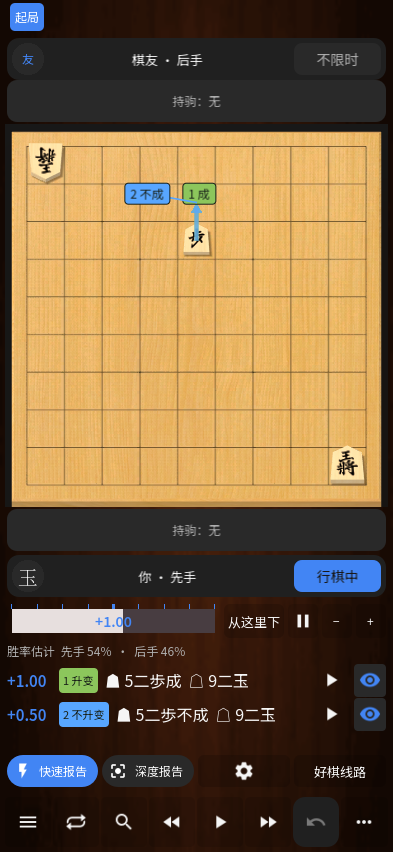

# 升变提示 / Promotion hints / 成りのヒント

候选线路首手需要升变时，评分旁显示「升变」；进入或离开敌阵但推荐保留原棋子时，显示「不升变」。棋盘箭头落点对应显示「成／不成」，编号和颜色与候选线路一致。同一落点的两种选择会分开放置，以连线指向同一目标格；关闭一条线路后，其余编号不会改变。

完整线路文字保留「成」，并对放弃升变的着手补上「不成」。这也适用于线路中后续的着手。失误练习第一次提示只指出棋子；第二次完整提示同时说明升变选择，并在棋盘上标记。

持驹打入、金将、玉将、已经升变的棋子，以及不能升变的普通着手不会显示升变标记。先手和后手、二维和 3D 棋盘、翻转、强制升变都采用同一套提示判断。点击预览仍按引擎提供的完整着手执行，提示不会自动替玩家作出选择。

The candidate row explicitly says **Promote** or **Do not promote**. English board badges use the same line number with **+** or **=**, respectively. Multiple alternatives to the same square remain separate. The move sequence includes **成** for promotion and **不成** when promotion is available but declined. Full practice hints also explain the choice; the first, partial hint still reveals only the piece.

候補手の先頭に「成る／成らない」を表示し、盤上には同じ候補番号の「成／不成」を表示します。同じ移動先の候補も区別できます。読み筋の途中の不成も明記します。駒打ち、金・玉、成駒などに誤って成りの印を付けません。復習問題では、最初のヒントは駒だけを示し、完全なヒントで成・不成を表示します。

See [validation / 测试记录](TESTING-0.32.md).
