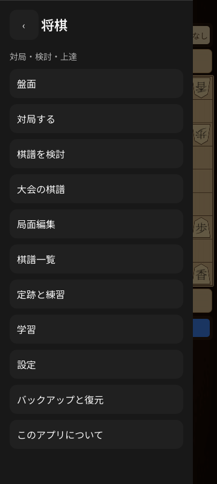
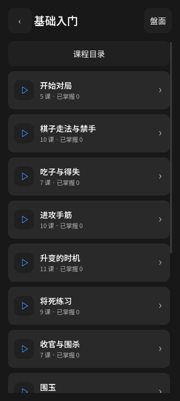

# 0.34.1 日文字体与推荐好手验证

本地共 **1309 项检查通过**：字体与推荐开关 90、棋盘和三语界面 755、升变提示 179、保存流程 76、Windows 成品 148、APK 61。这是断言次数，不代表独立功能数量。

日文字体主字形使用 400 字重，而缺少字形时原来会落到默认 100 的中文备用字体。修复后，实际排版出的中日文混排字形在正文中全部使用 400，在标题中全部使用 600。菜单“局面编辑”和“关于”补齐翻译；已有标题随语言切换更新。菜单、教程目录与章节截图已检查。

真实引擎与实际触摸测试验证“推荐好手”第二次点击会停止分析，移除候选行及棋盘箭头；搜索和推荐入口可交替开关，迟到回调不恢复已隐藏提示。候选预览中再次点击会退出预览并关闭推荐，原对局和棋谱库不变。

Android 14 实机验证最终 APK 的日文菜单、教程目录及推荐开关，安装包哈希与发布包一致。 验证范围见 [机器可读记录](releases/v0.34.1-validation.json)。课程正文仍包含未翻译的中文，未宣称完整日文翻译或全功能实机验收。

运行 `Godot --path godot -- --unified-test --fonts-hints`；CI 同时覆盖既有核心回归、菜单冷启动、三语界面、升变及保存流程。
