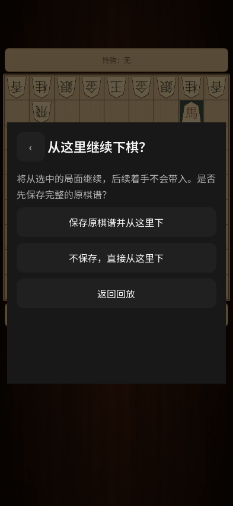

# 0.34.2 回放续下验证

本地 **330 项断言通过**：保存、回放与续下 121 项，Windows 成品 148 项，APK 61 项。

复现了旧版取消续下会退出历史回放、丢失所选进度的问题。修复后的触摸测试从工具栏连续回退，再点击“从这里下”：返回回放保留原局面；不保存续下后能通过实际棋盘点击走出下一手；保存续下会保留原棋谱的完整后续着手。原棋谱对象不变，续下停止自动播放。中、日、英文确认框已检查。

Android 14 手机已安装最终 APK，文件哈希与发布包一致；实机确认续下入口及返回回放保留进度。手机对局未用于落子测试。

完整回归：`Godot --path godot -- --unified-test --chessis34`。单独续下验证追加 `--replay-continuation`。详细结果见 [验证记录](releases/v0.34.2-validation.json)。
