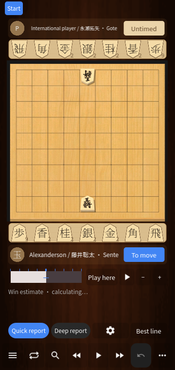

# 0.34 棋盘、多语言与保存流程验证

本地最终记录共 **2400 项检查**，无失败。核心规则周边 385 项；保存流程 75、棋盘与多语言 703；变化 110、档案 169、导入 132、开局 267、提示 179、大赛 171；Windows 成品 148、APK 61。这些是断言次数，不代表独立功能数量，不能保证没有 bug。

- 棋盘画面覆盖中、英、日三种语言，2D / 3D、360×760 / 393×852 / 852×393，另检查浅色棋盘及保存界面。持驹宽高比例固定；姓名、计时和头像互不覆盖；菜单覆盖棋盘时保持棋盘尺寸。英文、日文设置与常驻控件会随语言刷新。
- 保存测试通过实际触摸事件验证继续编辑、放弃、保存及写入失败重试。纯回放不新增棋谱；旧棋谱的未保存注释不会覆盖原文件；文件导入可以只载入；续下保留手数、升变状态；异步等待保存选择后继续操作一次。
- 升变和不升变提示、合法打入、变化持久化、档案预览、导入错误恢复及官方大赛缓存仍通过对应回归。
- 成品再次验证保存选择、实际引擎与预览动画。Windows 首张棋盘 2238 毫秒。APK 验证延续签名、ARM64、16 KiB 对齐及新增模块，未包含测试夹具或付费模块。
- 本机保留了 Android 安装日志和界面截图，但上次任务中断前未完成本版实机验证汇总；本报告不将其计为已通过的实机验收。此前 0.33 的实测见 [实机报告](ANDROID-DEVICE-BASELINE.md)。

截图检查发现并修复了英文 Board 按钮断词、部分文案漏译和长英文标题导致保存对话框过高。首轮保存布局及快速注释编辑的过期滚动目标问题也已修复。测试夹具中的外语已翻译表头识别误报单独修正，失败尝试不计入通过数。

运行 `./scripts/test_chessis34.ps1 -Probes board-hud,chessis34,chessis25,chessis33,chessis30,chessis29,chessis32,chessis31`。CI 包含三语绘制测试和现有核心回归。

高级报告、部分导入说明和课程仍有中文，不能称为完整三语翻译。未保存的变化仍仅驻留内存；进程被系统杀死时不能恢复。Windows 绘制停顿、双机蓝牙及完整 Chessis 功能对齐仍未验收。

[保存用法](OPTIONAL-SAVING.md) · [机器可读结果](releases/v0.34.0-validation.json) · [复刻差距](CHESSIS-PARITY.md)
