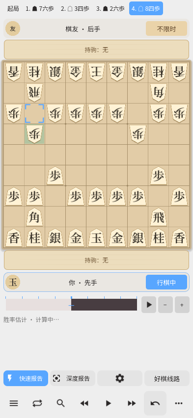
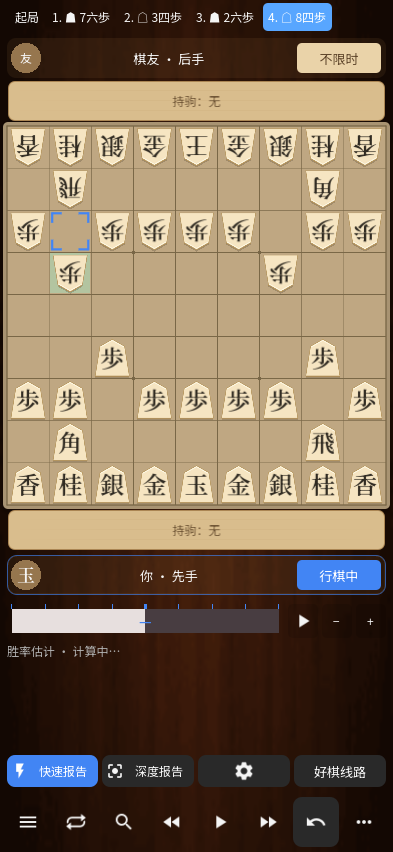

# 0.35.0 二维棋盘与回放验证

本地 **1164 项断言通过**：回放与正常对局 79 项，棋盘、三语和布局 755 项，保存与历史续下 121 项，Windows 成品 148 项，APK 61 项。

通过实际工具栏与棋盘触摸检查：回退两手再前进到最新，立即继续落子并悔棋；停在历史第一手时悔棋撤销当前对局最后一手并恢复正常对局；自动回放到末尾停止；手动翻阅暂停自动播放。人机对局保持原执棋方和成对悔棋规则。导入棋谱的末尾仍保持独立回放，不会误悔当前对局。二维与立体均覆盖。

二维保留与原 3D 棋盘一致的背景。浅色、深色、横屏、竖屏以及书法平面模式截图已检查；棋字由可变字体默认 200 字重改为 600，棋子、持驹计数、行棋方及工具栏同步调整。

Android 14 已安装最终发布 APK并完成所列实机检查，详见下方验证记录。 实机与本地验证范围分别记录，未宣称全部功能均在手机逐项测试。

运行 `Godot --path godot --resolution 360x760 -- --unified-test --live-navigation`，布局与保存回归分别使用 `--board-hud`、`--chessis34`。详细结果见 [验证记录](releases/v0.35.0-validation.json)。
