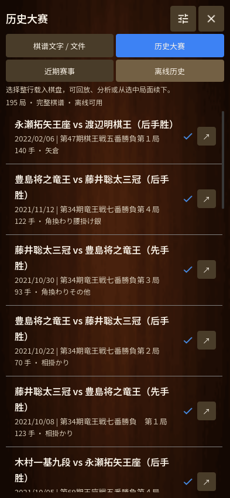
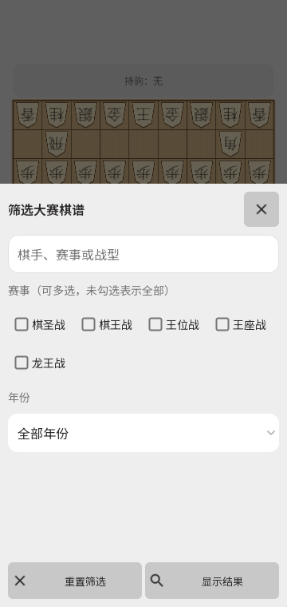

# 大赛棋谱库 · Tournament archive · 大会棋譜

0.31 将历史大赛改为完整木纹列表与独立底部筛选面板。点击整行即可载入棋盘，右侧保留官方来源按钮。近期官方目录与离线历史共用列表，并在当前会话内分别记住筛选条件、已显示条数和滚动位置。

## 查找与回放

- 右上角筛选按钮打开底部面板；输入棋手、赛事或战型，勾选一个或多个赛事，并可限定年份。多个赛事表示“任一赛事”；不同搜索词与年份一起生效。
- “显示结果”应用草稿并返回列表；关闭或返回不应用草稿，保留原滚动位置。“重置筛选”清空并立即显示全部结果。
- 初始显示 20 局，“显示更多对局”增加 20 局。加载完整棋谱后保留原进行中的对局，在回放位置可继续下、打开分析或查看来源。
- 圆形进度仅标在正在读取的那一局上。蓝色勾表示有内置棋谱，或本机缓存的着手哈希与目录相符；每次载入仍会完整检查合法性，缓存标记不能替代校验。

离线库仍为 195 局、23,115 手；近期目录为 26 局。目录的每日更新配置不变，发布并启用默认分支工作流后才会持续获取新的目录。完整近期棋谱按需从官方 KIF 下载，未包含付费来源或未结束的对局。

读取本地和在线棋谱的完整合法性检查使用独立线程。关闭页面、切换来源或打开筛选后，旧请求不会替换后来查看的棋局。已经开始的下载可以完成并保存缓存；再点该对局时会重新校验并载入。界面中断不会强行终止校验线程，应用退出会等待线程结束。

## English

The tournament archive uses a full wooden list and a separate bottom filter sheet. Select multiple events, a year and player/event keywords; Apply commits the draft, Close discards it and Reset clears it immediately. Within the session, recent and offline sources retain separate filters and scroll positions. Load More adds twenty records at a time.

Tap the entire row to open a complete game. Only the requested game shows download progress; the source link remains separate. A check mark means a bundled record or cached move payload matching the catalog. Every load still performs complete legal-move validation in a private worker. Late results from a dismissed flow may populate cache, but cannot replace the current replay. This does not add paid content or imply that all original archive features have been reproduced.

## 日本語

大会棋譜を木目の一覧と独立した下部フィルターに変更しました。大会の複数選択、年、棋士・戦型の検索を組み合わせられます。「表示」は変更を適用し、閉じる操作は破棄、「リセット」は条件をクリアします。最近の大会と過去棋譜は、それぞれ条件とスクロール位置を保持します。

行全体をタップして完全な棋譜を読み込めます。処理中の対局だけに進捗を表示し、公式ページへのボタンも残しています。青いチェックは同梱棋譜、または一覧の指し手ハッシュと一致する保存データを表し、読み込み時には別スレッドで全手の合法性を確認します。閉じた画面への古い結果は現在の棋譜を置き換えません。

## 参考と検証範囲

静态参考为用户提供的 Chessis 20.9：`dialog_recent_games.xml` 的全页木纹列表；`dialog_gm_games_item.xml` 的 16sp 标题、13sp 副标题、12sp 描述、行内缓存／进度；`dialog_gm_games_filter.xml` 的搜索、多选赛事、重置／显示结果；`p079K2/C0678g.java` 的底部进入、草稿确认与重置立即返回；`C0674c.java` 和 `C0680i.java` 的整行选择和下载状态。将棋版按安全区域适配，并保留新增的年份与近期／离线来源选择。

原版“我的棋谱／大师棋谱”共享档案、批量操作、精选、已注释／已分析与战术标签仍未全部统一到本页；没有伪造这些元数据，也没有付费锁。所提供 APK 缺少必要分包，未运行原版逐屏像素核对。Android 真机、蓝牙与后台恢复仍待实测，Windows 绘制停顿本身仍未解决。

详见 [验证记录](TESTING-0.31.md)、[赛事更新](TOURNAMENT-UPDATES.md) 与 [完整差距](CHESSIS-PARITY.md)。
