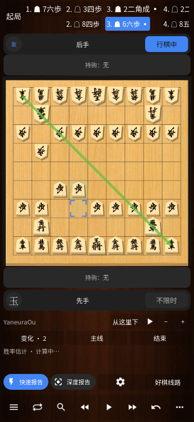

# 同一棋谱中的变化分析

0.25 在棋盘更多菜单中增加「试下变化」。选中历史中的任一步即可试下，原来的对局在后台暂停。从 0.34 起，打开与回放本身不存档；修改后可以保存、不保存或继续编辑。重新打开已有记录并保存修改，会更新同一份棋谱。

上排是主线，下排是当前选中的变化。点击着手定位棋盘，长按或右键打开着手菜单；「变化」页列出主线、分支及嵌套分支。每个节点可以保存自己的注释、圆圈和箭头，相同局面通过不同线路到达时也不会混用注释。



- 首次分歧着手先选择「保留主线，另存为变化」或「替换后续主线」，确认前不改棋谱。设置 → 棋盘与棋子中可修改。
- 手动「提升为主线」保留原主线为另一条变化；自动「替换」移除第一次分歧之后的原主线及其子变化。两者均可撤销。
- 删除变化移除整棵子树，并提供撤销。最近 8 次编辑可撤销；撤销历史只在当前编辑会话保留。
- 从变化中的某一步继续对弈会保留完整树，把所选路径设为新棋局的主线。退出原分析时可选择保存或不保存。
- 实时分析、整局报告和候选预览使用所选线路。返回分析后恢复对应的棋谱和位置。

完整变化通过 JSON 保存、导出和备份。为避免静默丢失分支，带变化的棋谱默认导出 JSON，并标明 KIF／CSA／USI 只导出主线；SFEN 只表示当前局面。没有实现跨文件变化合并或 KIF 的变化段方言。

读取时逐步校验父子连接、完整主线路径、节点编号、合法着手、终局、注释和绘图范围。最多 4096 个节点、单条线路 2000 手，单个存档最多 2 MiB。保存失败保留内存中的修改并显示重试，也可明确选择不保存；超限保存不会覆盖已有棋谱。原有无变化 JSON 格式仍可读取。

## 参考与验证

界面和交互依据用户所附 Chessis 20.9 的 `item_variation.xml`、`move_notation_item.xml`，以及 `C4191e.java`、`C0039u.java` 和 `C4239p.java` 的静态证据：双行着手、可点击的变化文本、长按、删除撤销，以及默认替换／保留策略。删除图标沿用已记录来源的原矢量。没有在原版 Android 环境下逐屏运行对照。

核心测试涵盖嵌套路径、换线、删除、持久化、转置局面的独立注释、超限、损坏数据和千日手；界面测试使用真实触摸事件，覆盖长按、两种外观、横竖屏、备份恢复、实际引擎报告、候选返回和保存失败。复现命令：

```powershell
./scripts/test_chessis25.ps1 -CoreOnly
./scripts/test_chessis25.ps1
```

CI 使用虚拟显示运行变化界面，用 `--portable-variation` 跳过依赖 Windows 引擎程序的实际报告部分；本机 Windows 测试执行该部分。发布前证据见 [0.25 验证结果](TESTING-0.25.md)。
